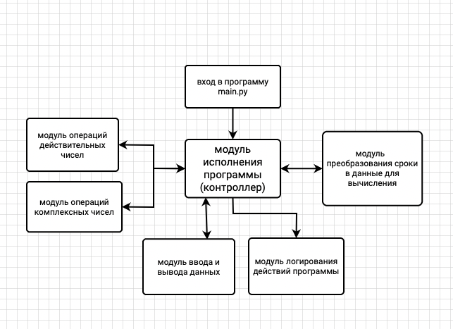
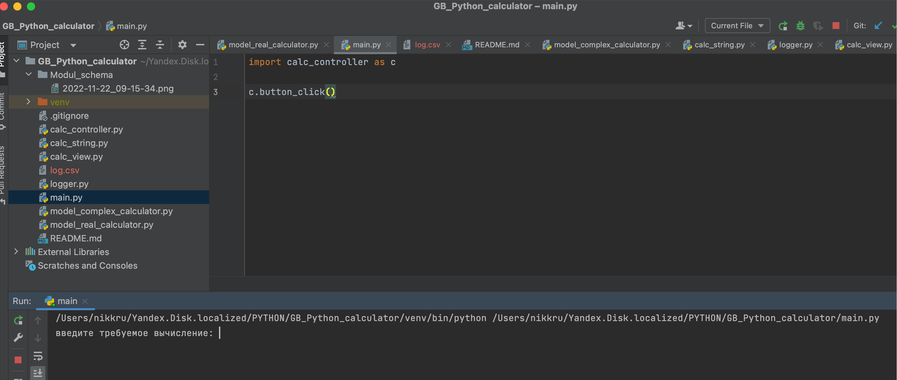
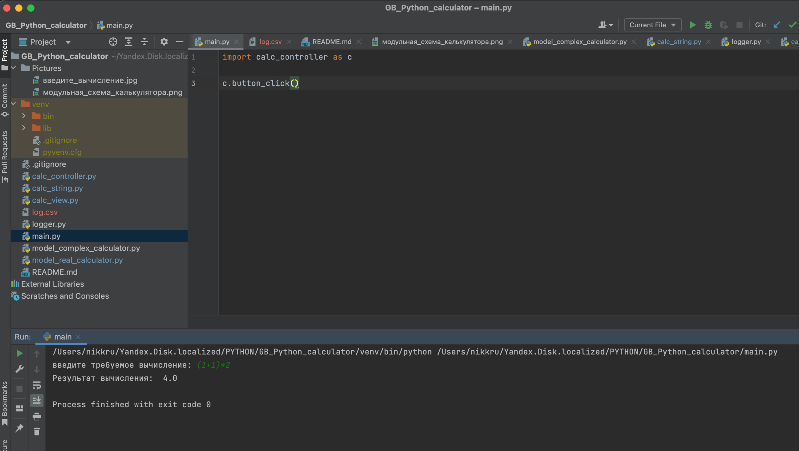
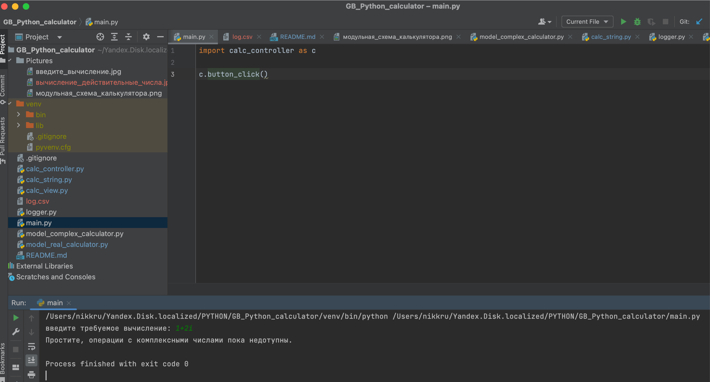
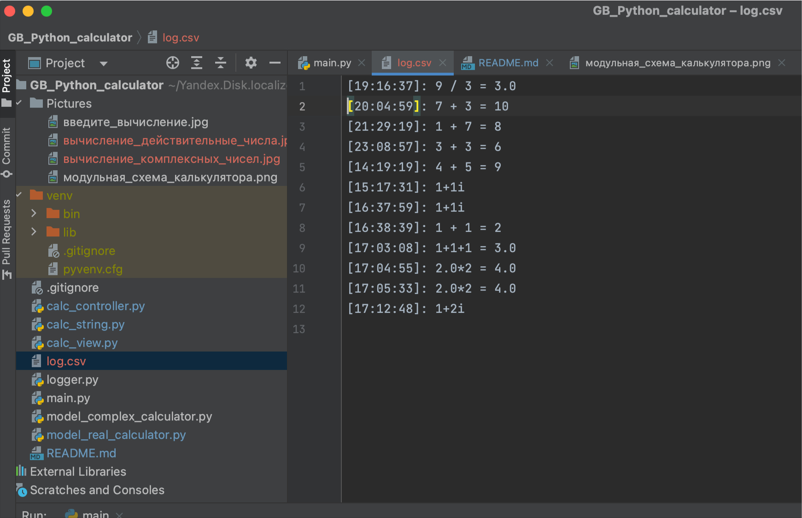

# GB_Python_calculator
training project. in progress now

Домашняя работа к уроку №7.

Задача:
"Добить калькулятор. Создать репо в гитхабе , скинуть туда всё и обязательно скрины работы всех модулей! 
в Readme описать архитектуру приложения, указать кто над каким модулем работал.
на ОТЛИЧНО 
- должно быть логгирование, 
- функции eval не должно быть, 
- грамотный и красивый ридми, где приложено описание работы приложения + модульная архитектура. 
Тем , кто делает в одиночку, можно юзать eval 
для комплексных чисел. Если команда разработала графический интерфейс, то комплексные числа может не делать.
На ХОРОШО - допускается eval для комплексных чисел.
На УДОВЛ - можно везде юзать eval.
юзать другие готовые функции равнозначно использованию eval."

ВЫПОЛНЕНИЕ:

МОДУЛЬНАЯ СХЕМА ПРОГРАММЫ

- исполняющий файл main.py обращается к методу button_click в модуле controller.py
- метод button_click инициализирует выполнение программы:
    - обращается к методу get_calc_string модуля calc_view.py, 
    выводящем в консоль предложение ввести пользователю строку требуемого вычисления

    - полученное значение сохраняется в переменной calc_str
    - по условию: есть ли в операндах вычисления маркер комплексного числа - знак 'i',
    инициализирует значения свойств модулей работы с комплексными числами (model_complex_calculator) или
    с действительными числами (model_real_calculator)
    - запускает метод исполнения арифметического выражения выбранным модулем,
    присваивая полученное значение переменной result
    - обращается к методу view_data_lst модуля calc_view.py, 
    который выводит в консоль значение переменной result

    - создает переменную log_str и присваевает ей значение строки, собранной из операндов вычисления и его результата
    - обращается к модулю logger и через его метод log_operation создает файл log.csv 
    с даннми о дате исполнения и значениях арифметической операции пользователя
